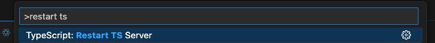
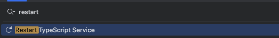

## 11장 CSS in JS
### 11.1 CSS-in-JS란
#### 1. CSS-in-JS와 인라인 스타일의 차이
- CSS-in-JS는 CSS-in-CSS보다 더 강력한 추상화 수준을 제공하며 스타일을 선언적이고 유지보수할 수 있는 방식으로 표현 가능
- 인라인 스타일은 HTML 요소 내부에 직접 스타일을 적용하는 방식으로 HTML 태그의 style 속성을 사용하여 적용할 수 있다
- 스타일이 적용된 결과를 보면 인라인 스타일은 DOM 노드에 속성으로 스타일을 추가하고 CSS-in-JS는 DOM 상단에 <style> 태그를 추가하여 스타일을 적용한다
- CSS-in-JS를 사용하면 실제로 css가 생성되기 때문에 미디어 쿼리, pseudo 선택자 같은 기능을 누릴 수 있음 + SASS 기능(styled components)
- CSS-in-JS의 장점
  - 컴포넌트로 생각할 수 있음: 스타일을 컴포넌트 단위로 추상화하여 생각할 수 있게 해줌
  - 부모와 분리할 수 있음: CSS는 부모 요소에서 자동으로 상속되는 속성이 있지만 CSS-in-JS는 부모와 독립되어 동작
  - 스코프를 가짐: CSS는 하나의 전역 네임스페이스를 가지기 때문에 선택자 충돌을 피하기 어려움. CSS-in-JS는 컴포넌트 스코프를 가지기 때문에 선택자 충돌을 피할 수 있음
  - 벤더 프리픽스: 자동으로 벤더 프리픽스를 추가하여 브라우저 호환성 향상
  - 자바스크립트와 CSS 사이에 상수와 함수를 쉽게 공유 가능

#### 2. CSS-in-JS 등장배경
- css의 7가지 문제점
1. Global Namespace(글로벌 네임스페이스): 모든 스타일이 전역 공간을 공유하므로 중복되지 않는 CSS 클래스 이름을 고민해야 함
2. Dependencies(의존성): CSS의 의존성과 자바스크립트의 의존성이 달라서 꼭 필요한 스타일이 누락되는 문제 발생(현재는 번들러의 발전으로 거의 해결)
3. Dead Code Elimination(죽은 코드 제거): 사용하지 않는 CSS 코드가 번들에 포함되어 파일 크기가 커지는 문제
4. Minification(최소화): 클래스 이름을 최소화하기 어려움
5. Sharing Constants(상수 공유): CSS와 자바스크립트 사이에 상수를 공유하기 어려움
6. Non-deterministic Resolution(비결정적 해결): CSS 로드 순서에 따라 스타일 우선순위가 달라짐
7. Isolation(고립): CSS의 외부 수정을 관리하기가 어려움

#### 3. CSS-in-JS 사용하기
```tsx
import styled from "@emotion/styled";

export const Button = styled.button<{ primary: boolean }>`
  background: transparent;
  border: none;
  cursor: pointer;
  font-size: inherit;
  padding: 0;
  margin: 0;
  color: ${({ primary }) => (primary ? "red" : "blue")};
`;
```
만약 variant props의 유형에 따라 다른 스타일을 적용하고 싶다면 css 함수를 사용하여 스타일을 정의하고 variant 값에 따라 맵 객체를 생성하여 사용가능

```tsx
import { css, SerializedStyles } from "@emotion/react";
import styled from "@emotion/styled";

type ButtonRadius = "xs" | "s" | "m" | "l";

export const buttonRadiusStyleMap: Record<ButtonRadius, SerializedStyles> = {
  xs: css`
    border-radius: ${radius.extra_small};
  `,
  s: css`
    border-radius: ${radius.small};
  `,
  m: css`
    border-radius: ${radius.medium};
  `,
  l: css`
    border-radius: ${radius.large};
  `,
  };

export const Button = styled.button<{ radius: string }>`
  ${({ radius }) => css`
    /* ...기타 스타일은 생략 */
    ${buttonRadiusStyleMap[radius]}
  `}
`;
```

RoundButton, SquareButton 등 여러 버튼 컴포넌트를 구현해야 한다면, 공통적인 버튼 스타일을 따로 정의한 다음에 각 컴포넌트 스타일에서 이를 확장하여 구현 가능

```tsx
const RoundButton = styled(CommonButton)``;
const SquareButton = styled(CommonButton)``;
```

### 11.2 유틸리티 함수를 활용하여 Styled-components의 중복 타입 선언 피하기
먼저 유틸리티 타입을 활용하지 않을 때 어떤 불편함이 생기는지 알아보자

#### 1. props 타입과 styled-components 타입의 중복 선언 및 문제점
```tsx
interface Props {
  height?: string;
  color?: keyof typeof colors;
  isFull?: boolean;
  className?: string;
  // ...
}

export const Hr: VFC<Props> = ({ height, color, isFull, className }) => {
  // ...
  return (
    <HrComponent
      height={height}
      color={color}
      isFull={isFull}
      className={className}
    />
  ); 
};

interface StyledProps {
  height?: string;
  color?: keyof typeof colors;
  isFull?: boolean;
};

const HrComponent = styled.hr<StyledProps>`
  height: ${({ height }) => height || "10px"};
  margin: 0;
  background-color: ${({ color }) => colors[color || "gray7"]};
  border: none;
  
  ${({ isFull }) =>
    isFull &&
    css`
      margin: 0 -15px;
    `}
`;
```
Props와 StyledProps에서 동일한 속성(height, color, isFull)을 선언하고 있다. 이렇게 중복된 타입을 선언하면 코드의 가독성이 떨어지고 유지보수가 어려워진다.
Pick이나 Omit같은 유틸리티 함수를 사용하여 중복 선언을 피하고 코드의 가독성을 높일 수 있다.

```tsx
const HrComponent = styled.hr<Pick<Props, "height" | "color" | "isFull">>`
  // ...
`;
```

## 12장 타입스크립트 프로젝트 관리
### 1. 앰비언트 타입 선언
타입스크립트의 타입 선언은 .ts 또는 .tsx 확장자를 가진 파일에서 할 수 있지만 .d.ts 확장자를 가진 파일에서도 선언할 수 있다.

**앰비언트 타입 선언**
- `.d.ts` 확장자를 가진 파일에서는 타입 선언만 할 수 있으며 값을 표현할 수는 없음
  - 값을 포함하는 일반적인 선언과 구별하기 위해 앰비언트 타입 선언이라고 부름
- 앰비언트 타입 선언으로 값을 정의할 수는 없지만 declare라는 키워드를 사용하여 어딘가에 자바스크립트 값이 존재한다는 사실을 선언할 수 있음

**대표적인 앰비언트 타입 선언 활용 사례**
- 타입스크립트를 사용하다보면 `*.js` 또는 `*.ts` 형식이 아닌 파일을 임포트할 때 종종 에러가 발생함
- 이때 해당 파일의 타입을 선언하여 타입스크립트가 해당 파일을 이해할 수 있도록 도와주는 것이 앰비언트 타입 선언의 역할

```ts
// png 이미지 파일을 임포트할 때 발생하는 에러를 해결하기 위한 앰비언트 타입 선언
declare module "*.png" {
  const src: string;
  export default src;
}
```

**자바스크립트로 작성된 라이브러리**
- 자바스크립트로 작성된 npm 라이브러리가 있을 때 타입 선언이 존재하지 않아 모든 타입이 any로 추론될 것이고 빌드가 안되는 경우도 생김
  - 이때 자바스크립트 라이브러리 내부 함수와 변수의 타입을 앰비언트 타입으로 선언하면 타입스크립트는 자동으로 .d.ts 확장자를 가진 파일을 검색하여 타입 검사 진행
  - 또한 VSCode 같은 코드 편집기도 .d.ts 확장자를 가진 파일을 해석하여 코드를 작성할 때 유용한 타입 힌트를 제공
- 예를 들어 `@types/react`를 설치하면 `node_modules/@types/react`에 `index.d.ts`와 `global.d.ts`가 설치됨
  - 이 파일들에는 리액트의 컴포넌트와 훅에 대한 타입이 정의되어 있음
  - tsc는 별도의 설정 없이도 node_modules/@types 디렉터리에 있는 타입 선언을 타입 검사에 활용

**타입스크립트로 작성된 라이브러리**
- 타입스크립트로 작성된 라이브러리일지라도 자바스크립트 파일과 `.d.ts` 파일로 배포되는 것이 일반적
  - 타입스크립트 파일을 직접 배포해도 되지만 컴파일할 시간을 줄이기 위해서
  - tsconfig.json 파일의 declaration을 true로 설정하면 타입스크립트 컴파일러는 자동으로 `.d.ts` 파일을 생성

**자바스크립트 어딘가에 전역 변수가 정의되어 있음을 타입스크립트에 알릴 떄**
- 타입스크립트로 구현하진 않았지만 자바스크립트 어딘가에 전역 변수가 정의되어 있는 상황을 타입스크립트에 알릴 때 앰비언트 타입 선언을 사용
  - 예를 들어 웹뷰를 개발할 때 네이티브 앱과의 통신을 위한 인터페이스를 네이티브앱이 Window 객체에 추가하는 경우가 많음

```ts
// 아래처럼 선언해주지 않으면 타입스크립트는 Window 객체에 deviceId와 appVersion이 존재한다고 인식하지 못함
declare global {
  interface Window {
    deviceId: string | undefined;
    appVersion: string;
  }
}
```

#### 2. 앰비언트 타입 선언 시 주의점
- 타입스크립트로 만드는 라이브러리에는 불필요
- 전역으로 타입을 정의하여 사용할 때 주의해야 할 점
   - 서로 다른 라이브러리에서 동일한 이름의 앰비언트 타입 선언을 한다면 충돌이 발생할 수 있음
   - 앰비언트 타입 선언은 명시적인 import나 export가 없기 때문에 코드의 의존성 관계가 명확하지 않아 나중에 변경할 때 어려움 겪을 수 있음

#### 3. 앰비언트 타입 선언을 잘못 사용했을 때의 문제점
- `.ts` 파일 내의 앰비언트 변수 선언은 개발자에게 혼란을 야기할 수 있으니 `.d.ts` 파일에만 선언하는 것이 좋음
- 앰비언트 변수 선언은 어느 곳에나 영향을 줄 수 있기 때문에 일반 타입 선언과 섞이게 되면 앰비언트 선언이 어떤 파일에 포함되어 있는지 파악하기 어려워짐

```tsx
import React from "react";
import ReactDOM from "react-dom";
import App from "App";

// src/group/members/SomeComponent.tsx 파일 내에서 선언
declare global {
interface Window {
Example: string;
}
}
const SomeComponent = () = > {
  return <div>앰비언트 타입 선언은 .tsx 파일에서도 가능</div>;
};

//src/test.tsx에서도 import 없이 사용 가능
window.Example;
```

#### 4. 앰비언트 타입 활용하기
**타입을 정의하여 import 없이 전역으로 공유**
- 앰비언트 타입으로 유틸리티 타입을 선언하면 내장 타입 유틸리티 함수를 사용하는 것처럼 모든 코드에서 import 없이 해당 타입 사용 가능

```ts
// src/index.d.ts
type Optional<T extends object, K extends keyof T = keyof T> = Omit<T, K> &
  Partial<Pick<T, K>>;

// src/components.ts
type Props = { name: string; age: number; visible: boolean };
type OptionalProps = Optional<Props>; // Expect: { name?: string; age?: number; visible?: boolean;
```

**declare type 활용하기**
- 보편적으로 많이 사용하는 커스텀 유틸리티 타입을 declare type으로 선언하여 전역에서 사용할 수 있음

```ts
declare type Nullable<T> = T | null;

const name: Nullable<string> = "woowa";
```

**declare module 활용하기**
- 아래처럼 CSS-in-JS 라이브러리에서 theme의 인터페이스 타입을 확장하여 theme 타입이 자동으로 완성되게 하는 기능에 활용

```ts
const fontSizes = {
  xl: "30px",
  // ...
};

const colors = {
  gray_100: "#222222",
  gray_200: "#444444",
  // ...
};

const depths = {
  origin: 0,
  foreground: 10,
  dialog: 100,
  // ...
};

const theme = {
  fontSizes,
  colors,
  depths,
};

declare module "styled-components" {
  type Theme = typeof theme;
  export type DefaultTheme = Theme;
}
```

- 로컬 이미지나 svg 같이 외부로 노출되어 있지 않은 파일을 모듈로 인식하여 사용할 수 있게끔 만들 수도 있음
```ts
declare module "*.gif" {
  const src: string;
  export default src;
}
```

저는 왜 자바스크립트 모듈이 아니라는 에러를 본적 없나해서 봤더니 아래 설정이 되어있었습니다 ㅎㅎ
```json
{
  "compilerOptions": {
    "esModuleInterop": true,
    "allowJs": true
  }
}
```

**declare namespace 활용하기**
- Node.js 환경에서 .env 파일을 사용할 때 `declare namespace`를 활용하여 process.env로 설정값을 손쉽게 불러오고 환경변수의 자동 완성 기능을 쓸 수 있음

```ts
declare namespace NodeJS {
  interface ProcessEnv {
    readonly API_URL: string;
    readonly API_INTERNAL_URL: string;
    // ...
  }
}

// declare namespace를 활용하지 않은 경우
API_URL = "localhost:8080";

console.log(process.env.API_URL as string);

// declare namespace를 활용한 경우
API_URL = "localhost:8080";

declare namespace NodeJS {
  interface ProcessEnv {
    readonly API_URL: string;
  }
}

console.log(process.env.API_URL);
```

**declare global 활용하기**
- 전역변수를 선언할 때 사용

```ts
// 아래처럼 선언하면 자동완성 기능 활용 가능
declare global {
  interface Window {
    webkit?: {
      messageHandlers?: Record<
              string,
              {
                postMessage?: (parameter: string) => void;
              }
      >;
    };
  }
}
```

#### 5. declare와 번들러의 시너지

declare global로 전역 변수를 선언하는 과정과 번들러를 통해 데이터를 주입하는 절차를 함께 활용하면 시너지를 낼 수 있다.

```ts
const color = {
  white: "#ffffff",
  black: "#000000",
} as const;

type ColorSet = typeof color;

declare global {
  const _color: ColorSet;
}

const white = _color["white"];
```

아직 _color 객체의 실제 데이터가 존재하지 않지만 타입스크립트 에러를 발생시키지 않아 예상치 못한 동작을 할 수 있다. 이러한 문제를 해결하기 위해 번들 시점에 번들러를 통해 해당 데이터를 주입할 수 있다.

**롤업 번들러의 inject 모듈로 데이터 주입**

```ts
// data.ts
export const color = {
  white: "#ffffff",
  black: "#000000",
} as const;

// type.ts
import { color } from “./data”;
  type ColorSet = typeof color;
  declare global {
  const _color: ColorSet;
}

// index.ts
console.log(_color[“white”]);

// rollup.config.js
import inject from "@rollup/plugin-inject";
import typescript from "@rollup/plugin-typescript";
export default [
  {
    input: "index.ts",
    output: [
      {
        dir: "lib",
        format: "esm",
      },
    ],
    //롤업 번들러 설정에서 `inject` 모듈을 사용하여 `_color`에 해당하는 데이터를 삽입하고 있다.
    plugins: [typescript(), inject({ _color: ["./data", "color"] })],
  },
];
```

### 12.2 스크립트와 설정 파일 활용하기
#### 1. 스크립트 활용하기
**실시간으로 타입을 검사하자**
- 프로젝트 규모가 커지면 에디터가 타입 에러를 알려주는 속도가 느려짐. 특정 파일을 열어야만 나타나거나 뒤늦게 git hook 도구인 husky에 의해 발견되기도 함
- 그럴때는 아래 스크립트를 사용하여 실시간으로 에러 확인 가능

```shell
yarn tsc --noEmit --incremental -w
```
- `noEmit` 옵션은 자바스크립트로 된 출력 파일을 생성하지 않도록 설정한 것
- `incremental` 옵션은 증분 컴파일을 활성화하여 컴파일 시간을 단축하게 해줌
  - 증분 컴파일: 모든 파일을 다시 컴파일하는 대신 변경된 파일만 다시 컴파일하는 기능 
- w는 파일 변경 사항을 모니터링한다는 의미

**타입 커버리지 확인하기**
- 타입스크립트로 작성된 코드의 타입 커버리지를 확인하려면 아래 스크립트를 사용
  - 현재 프로젝트의 타입 커버리지와 any를 사용하고 있는 변수의 위치가 나타남

```shell
npx type-coverage --detail
```

#### 2. 설정 파일 활용하기
- 아까 살펴보았던 incremental 속성을 tsconfig.json 파일에 추가하여 컴파일 시간을 단축할 수 있음

```json
{
  "compilerOptions": {
    "incremental": true
  }
}
```

#### 3. 에디터 활용하기
- 에디터에서 때로는 정의된 타입ㅂ이 있는 객체인데도 import되지 않거나 자동 완성 기능이 동작하지 않는 경우를 종종 볼 수 있음
- 타입스크립트 서버를 재실행하면 됨

**vscode**
- `Cmd + Shift + P`를 눌러 명령 팔레트를 열고 `TypeScript: Restart TS Server`를 입력하면 타입스크립트 서버가 재시작됨


**Webstorm과 Intellij**
- `Shift + Shift`를 눌러 검색창을 열고 `Restart Typescript Service`를 클릭하여 재실행


### 12.3 타입스크립트 마이그레이션
#### 1. 타입스크립트 마이그레이션의 필요성
- 때로는 마이그레이션보다 새로운 프로젝트를 시작하는 것이 더 나을 수도 있음
- 우아한 형제들에서도 새로운 프로젝트를 구축한 사례가 더 많음

#### 2. 점진적인 마이그레이션
- 작은 부분부터 시작하여 점진적으로 마이그레이션하는 방법이 있음
- 하지만 무기한으로 미루게 될 수 있으므로 우선순위를 정해놓는 것이 좋음

#### 3. 마이그레이션 진행하기
- 타입스크립트 마이그레이션을 진행하기로 했다면 다음과 같은 단계를 거치게 됨
  1. 타입스크립트 개발 환경을 설정하고 빌드 파이프라인에 타입스크립트 컴파일러를 통합
     - `allowJS: true`: 자바스크립트 함수를 타입스크립트에서 import할 수 있게하거나 타입스크립트 함수를 자바스크립트로 import할 수 있게 함
     - `noImplicitAny: false`: any 타입이 있을 때 에러를 발생시키지 않음
  2. 작성된 자바스크립트 파일을 타입스크립트 파일로 변환
  3. 기존 자바스크립트 파일을 모두 타입스크립트로 변환하였다면 `allowJS:false` `noImplicitAny: true`로 설정하여 타입이 명시되지 않은 부분이 없는지 확인

### 모노레포
#### 1. 분산된 구조의 문제점
- 여러 프로젝트를 관리할 때 개별 프로젝트마다 별도의 레포지토리를 생성하여 관리하는데 공통된 기능이 있다면 복사/붙여넣기를 하게 됨
- 뒤늦게 수정이 필요한 경우 모든 프로젝트를 수정해야 하는 번거로움이 있음

#### 2. 통합할 수 있는 요소 찾기
- 먼저 프로젝트 내에서 공통으로 통합할 수 있는 요소를 찾아야 함

#### 3. 공통 모듈화로 관리하기
- 공통 모듈을 npm과 같은 패키지 관리자를 활용하여 관리한다면 모든 프로젝트에서 해당 모듈을 사용할 수 있음
- 하지만 공통 모듈에 변경이 발생한다면 모든 프로젝트에서 해당 모듈을 사용하는 부분을 수정해야 함
- 또한 공통 모듈이 새로 필요하다면 새로운 레포지토리를 생성하여 CI/CD 파이프라인도 재구축하고, Lint, 테스트 등 모든 설정을 다시 해야 함

#### 4. 모노레포의 탄생
- 모노레포란 버전 관리 시스템에서 여러 프로젝트를 하나의 레포지토리로 통합하여 관리하는 소프트웨어 개발 전략
- 이전에는 다양한 프로젝트를 하나의 레포지토리로 관리하는 모놀리식 기법을 사용했지만 이 구조는 코드 간의 직접적인 의존이 발생하여 일부 로직만 변경될 때도 전체 프로젝트에 영향을 줄 수 있었음
- 모노레포는 여러 프로젝트를 하나의 레포지토리로 관리하면서도 각 프로젝트를 독립적으로 관리할 수 있게 해줌
- 모노레포의 장점
  - 프로젝트의 Lint, 테스트, 빌드 설정을 통합하여 관리할 수 있음
  - 공통 모듈을 패키지 관리자를 통해 게시하지 않아도 되어 편리함
- 모노레포의 단점
  - 시간이 지나며 레포지토리가 거대해질 수 있음
  - 하나의 레포지토리에 여러 팀의 이해관계가 얽혀있다면 소유권과 권한 관리가 복잡해질 수 있음
  - 각 프로젝트나 모듈의 소유권을 명확히 정의하고 규칙을 설정해야 하는 과정이 별도로 필요
