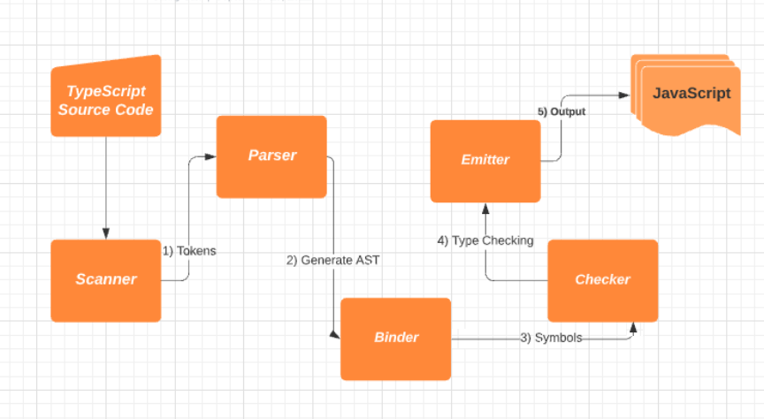

## 1. 자바스크립트의 런타임과 타입스크립트의 컴파일

### 런타임과 컴파일타임

- 고수준 언어: 사람이 이해하기 쉬운 형식으로 작성된 언어
- 저수준 언어: 컴퓨터가 이해하기 쉬운 형식으로 작성된 언어

> 자바스크립트는 대표적인 고수준 언어에 속하며 컴파일러나 인터프리터에 의해 저수준 프로그래밍 언어에 의해 저수준 프로그래밍 언어 즉, 기계가 이해할 수 있는 언어로 번역되어 실행된다.

- 컴파일타임: 소스코드가 컴파일 과정을 거쳐 컴퓨터가 인식할 수 있는 기계어 코드(바이트 코드)로 변환되어 실행할 수 있는 프로그램이 되는 과정
- 런타임: 컴파일 과정을 마친 응용 프로그램이 사용자에 의해 실행되는 과정

### 자바스크립트 런타임

- 자바스크립트가 실행되는 환경
  - 웹 브라우저, Node.js
  - 자바스크립트 엔진, 웹 API, 콜백 큐, 이벤트 루프, 렌더 큐 등으로 구성

### 타입스크립트의 컴파일

#### 일반적인 컴파일

- 일반적으로 추상화 단계가 다른 고수준 언어에서 저수준 언어로 변환되는 과정

#### 타입스크립트의 컴파일

- tsc라고 불리는 컴파일러를 통해 자바스크립트 코드로 변환
- 고수준 언어(타입스크립트)가 또 다른 고수준 언어(자바스크립트)로 변환
- 이러한 이유로 컴파일이 아닌 트랜스파일이라고 부르기도 함
- 소스코드를 다른 소스코드로 변환하는 것이기에 타입스크립트 컴파일러를 소스 대 소스 컴파일러라고 지칭하기도 함

#### 타입스크립트의 컴파일 과정

> 타입스크립트는 `.ts` 확장자가 붙은 파일을 찾아내서 컴파일한 다음에 `.js` 확장자가 붙은 자바스크립트 파일을 만들어낸다. 타입스크립트 컴파일러는 소스코드를 해석하여 AST(최소 구문 트리)를 만들고 이후 타입 확인을 거치 다음에 결과 코드를 생성한다.

1. 타입스크립트 소스코드를 타입스크립트 AST로 만든다. (tsc)
2. 타입 검사기가 AST를 확인하여 타입을 확인한다. (tsc)
3. 타입스크립트 AST를 자바스크립트 소스로 변환한다. (tsc)
4. 자바스크립트 소스코드를 자바스크립트 AST로 만든다. (런타임)
5. AST가 바이트 코드로 변환된다. (런타임)
6. 런타임에서 바이트 코드가 평가되어 프로그램이 실행된다. (런타임)

## 2. 타입스크립트 컴파일러의 동작

> [!NOTE]
>
> #### 타입스크립트 컴파일러의 역할
>
> - 최신 버전의 타입스크립트 및 자바스크립트 코드를 구버전의 자바스크립트로 트랜스파일
> - 코드의 타입 오류 검사

### 코드 검사기로서의 타입스크립트 컴파일러

> 타입스크립트 컴파일러는 tsc binder를 사용하여 타입 검사를 하고, 컴파일타임에 타입 오류를 발견한다.
> 타입 검사를 거쳐 코드를 안전하게 만든 이후에 타입스크립트 AST를 자바스크립트 코드로 변환한다.

- 컴파일타임에 코드 타입을 확인하여 코드를 실행하지 않고도 오류를 확인 가능
- 즉, 컴파일타임에 문법 에러와 타입 관련 에러를 모두 검출 가능

### 코드 변환기로서의 타입스크립트 컴파일러

> 타입스크립트 컴파일러는 타입스크립트 코드를 각자의 런타임 환경에서 동작할 수 있도록 구버전의 자바스크립트로 트랜스파일한다.
> 이것이 타입스크립트 컴파일러의 두 번째 역할이다.

#### 자바스크립트 ES5으로 타입스크립트 컴파일

- 타입스크립트의 컴파일러의 `target` 옵션을 사용하여 특정 버전의 자바스크립트 소스코드로 컴파일 가능

```tsx
type Fruit = 'banana' | 'watermelon' | 'orange' | 'apple' | 'kiwi' | 'mango'
const fruitBox: Fruit[] = ['banana', 'apple', 'mango']

const welcome = (name: string) => {
  console.log(`hi! ${name} :)`)
}
```

```jsx
// ES5
'use strict'
var fruitBox = ['banana', 'apple', 'mango']

var welcome = function (name) {
  console.log('hi! '.concat(name, ' :)'))
}
```

#### 주의 사항

- 타입스크립트 코드가 자바스크립트 코드로 변환되는 과정은 타입 검사와 독립적으로 동작
  - 타입스크립트 컴파일러에서 타입 오류가 있더라도 일단 컴파일 진행
  - 타입스크립트 코드가 타이핑이 잘못되어 발생하는 에러 → 런타임 에러로 처리

```tsx
const name: string = 'zig'
const age: number = 'zig' // Type 'string' is not assignable to type 'number'.(2322)
```

```jsx
const name = 'zig'
const age = 'zig'
```

- 컴파일된 코드가 실행되고 있는 런타임에서 타입 검사를 할 수 없기 때문에 주의 필요

```tsx
interface Square {
  width: number
}

interface Rectangle extends Square {
  height: number
}

type Shape = Square | Rectangle

function calculateArea(shape: Shape) {
  if (shape instanceof Rectangle) {
    // 'Rectangle' only refers to a type, but is being used as a value here.(2693)
    // Property 'height' does not exist on type 'Shape'.
    // Property 'height' does not exist on type 'Square'.(2339)
    return shape.width * shape.height
  } else {
    return shape.width * shape.width
  }
}
```

> [!TIP]
>
> #### 타입스크립트 컴파일러 vs 바벨
>
> - 공통점: 소스코드를 ES5 이하의 자바스크립트 코드로 컴파일 가능
> - 차이점: 타입스크립트 컴파일러와 달리 바벨은 타입 검사를 진행하지 않음

## 3. 타입스크립트 컴파일러의 구조

#### 타입스크립트 컴파일러의 구성요소



| **스캐너**   | **파서**           | **바인더**              | **체커**                  | **이미터**                      |
| ------------ | ------------------ | ----------------------- | ------------------------- | ------------------------------- |
| `.ts` 토큰화 | 토큰 기반 AST 생성 | AST 노드 기반 심볼 생성 | AST + 심볼 기반 타입 검사 | AST + 코드 검사 기반 `.js` 생성 |

### 프로그램(Program)

- 타입스크립트 컴파일러는 `tsconfig.json`에 명시된 컴파일 옵션을 기반으로 컴파일 수행
- 먼저 전체적인 컴파일 과정을 관리하는 프로그램 객체(인스턴스)가 생성
- 프로그램 객체가 가장 최초로 불러온 파일을 기준으로 컴파일 과정 시작

### 스캐너(Scanner)

- 타입스크립트 소스 파일을 어휘적으로 분석하여 토큰을 생성하는 역할
- 소스코드를 작은 단위로 나누어 의미 있는 토큰으로 변환하는 작업 수행

```jsx
const woowa = 'bros'
```

- 스캐너의 코드 분석 결과
  - `ConstKeyword`
  - `WhitespaceTrivia`
  - `Identifier`
  - `WhitespaceTrivia`
  - `EqualsToken`
  - `WhitespaceTrivia`
  - `StringLiteral`
  - `EndOfFileToken`
- Reference
  - [playground-ts-scanner](https://www.npmjs.com/package/playground-ts-scanner)
  - [`SyntaxKind`](https://github.com/microsoft/TypeScript/blob/3a8c6307473a5350284699fbf0adc32a6b169a39/src/compiler/types.ts#L21)

### 파서(Parser)

파서는 생성된 토큰 목록을 활용하여 구문적 분석(Syntax analysis)을 수행한다. 이를 통해 실질적인 구조를 노드 단위의 트리 형태로 표현하고, 각각의 노드는 코드상의 위치, 구문 종류, 코드 내용과 같은 정보를 담는다. 이를 AST라고 한다.

- 스캐너로 나눈 토큰 정보를 이용하여 파서에서 AST 생성
- 생성된 토큰 목록을 활용하여 구문적 분석 수행
- 이를 통해 코드의 실질적인 구조를 노트 단위의 트리 형태로 표현하며, 각각의 노드는 코드상의 위치, 구문 종류, 코드 내용 같은 정보를 담고 있음

> [!NOTE]
>
> #### AST(Abstract Syntax Tree)
>
> - 컴파일러가 소스코드를 해석하는 과정에서 생성된 데이터 구조
> - 컴파일러는 어휘적 분석과 구문 분석을 통해 소스코드를 노드 단위의 트리 구조로 구성
> - AST의 최상위 노드는 타입스크립트 소스 파일이며, 최하위 노드는 파일의 끝 지점

#### [Typescript AST Viewer](https://www.typescriptlang.org/play/?ssl=1&ssc=6&pln=1&pc=7&install-plugin=playground-ts-scanner#code/MYewdgzgLgBA7iEcCGMC8MDkAjATiCTIA)로 확인한 AST 구조

```jsx
function normalFunction() {
  console.log('normalFunction')
}

normalFunction()
```


### 바인더(Binder)

- 체커 단계에서 타입 검사를 할 수 있도록 기반을 마련하는 역할
- 타입 검사를 위해 심볼이라는 데이터 구조를 생성
- 심볼은 이전 단계의 AST에서 선언된 타입의 노드 정보를 저장
- 결과적으로 바인더는 심볼을 생성하고 해당 심볼과 그에 대응하는 AST 노드를 연결하는 역할 수행

#### 심볼의 인터페이스

```jsx
export interface Symbol {
	flags: SymbolFlags // Symbol flags
	escapedName: string // Name of symbol
	declarations?: Declaration[] // Declarations associated with this symbol
	// ...
}
```

- `flags`: AST에서 선언된 타입의 노드 정보를 저장하는 식별자
- `declarations`: AST 노드의 배열 형태

#### 여러 가지 선언 요소에 대한 각각의 심볼 결과

```tsx
type SomeType = string | number
interface SomeInterface {
  name: string
  age?: number
}
let foo: string = 'LET'
const obj = {
  name: '이름',
  age: 10,
}

class MyClass {
  name
  age

  constructor(name: string, age?: number) {
    this.name = name
    this.age = age ?? 0
  }
}

const arrowFunction = () => {}

function normalFunction() {}

arrowFunction()
normalFunction()
const colin = new MyClass('colin')
```

```
Some Type → TypeAliasDeclaration
Some Interface → InterfaceDeclaration
foo → VariableDeclaration
obj → VariableDeclaration
MyClass → classDeclaration
arrowFunction → variableDeclaration
colin → variableDeclaration
```

### 체커(Checker)와 이미터(Emitter)

#### 체커

- 파서가 생성한 AST와 바인더가 생성한 심볼을 활용하여 타입 검사 수행
- 전체 컴파일 과정에서 차지하는 비중이 제일 큼
- AST의 노드를 탐색하면서 심볼 정보를 불러와 주어진 소스 파일에 대해 타입 검사를 진행하는 역할
- 체커의 타입 검사는 다음 컴파일 단계인 이미터에서 실행
- `checker.ts`의 `getDiagnotics()` 함수를 사용해서 타입을 검증하고 타입 에러에 대한 정보를 보여줄 에러 메세지 저장

#### 이미터

- 타입스크립트 소스 파일 변환 과정에서 이미터의 역할
  - 개발자가 설정한 타입스크립트 설정 파일을 읽어오기
  - 체커를 통해 코드에 대한 타입 검증 정보 가져오기
- `emitter.ts` 소스 파일 내부의 `emitFiles()` 함수를 사용하여 타입스크립트 소스 변환 진행

> [!IMPORTANT]
>
> #### 타입스크립트 컴파일 과정
>
> 1. tsc 명령어를 실행하여 프로그램 객체가 컴파일 과정을 시작한다.
> 2. 스캐너는 소스 파일을 토큰 단위로 분리한다.
> 3. 파서는 토큰을 사용하여 AST를 생성한다.
> 4. 바인더는 AST의 각 노드에 대응하는 심볼을 생성한다. 심볼은 선언된 타입의 노드 > 정보를 담고 있다.
> 5. 체커는 AST를 탐색하면서 심볼 정보를 활용하여 타입 검사를 수행한다.
> 6. 타입 검사 결과 에러가 없다면 이미터를 사용해서 자바스크립트 소스 파일로 변환한다.
